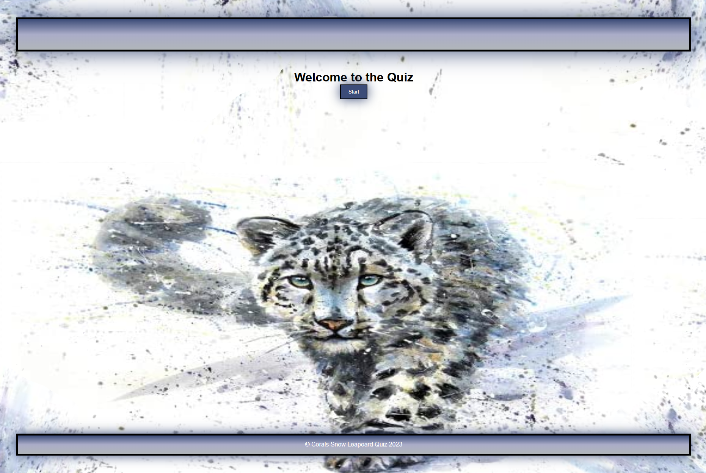

# Challenge 4 - "Coding Quiz with JS."

## Description

I was tasked with my forth challenge to make a coding quiz.

- This challenge so far was the hardest one to complete. 
- It took 2 weeks to finish. 
- Lots of study group hours put in.
- I used alot of youtube videos and W3school. 
- I wanted todo way more for this challenge. But for this challenege I am leaving it as is.
- I hope to come back to this challenge in the future and fix the style and add more JS elements.

I followed the criteria below provided by the class instructors.

## User Story

- AS A coding boot camp student
- I WANT to take a timed quiz on JavaScript fundamentals that stores high scores
- SO THAT I can gauge my progress compared to my peers

## Acceptance Criteria

- GIVEN I am taking a code quiz
- WHEN I click the start button
- THEN a timer starts and I am presented with a question
- WHEN I answer a question
- THEN I am presented with another question
- WHEN I answer a question incorrectly
- THEN time is subtracted from the clock
- WHEN all questions are answered or the timer reaches 0
- THEN the game is over
- WHEN the game is over
- THEN I can save my initials and score

## Mock-Up

The following image shows the welcome screen of my quiz.

> **Note**: This layout image is screen shot from a desktop computers web browser. It displays differently vs on Vscode.

## Credits

- https://www.youtube.com/watch?v=PBcqGxrr9g8
- https://www.youtube.com/watch?v=pQr4O1OITJo
- https://www.w3schools.com/
- https://developer.mozilla.org/en-US/docs/Web/JavaScript/Guide
- Tutoring

> **Note**: User story and acceptance criteria was provided to me in class
 UNB-VIRT-FSF-PT-04-2023-U-LOLC for Week 2 Challenge. I was given the website www.awwwards.com for inspiration of what professional portfolios could look like. 

## My Githubs

- https://xnoirnightx.github.io/Snow-Leopard-Quiz/

## License

N/A